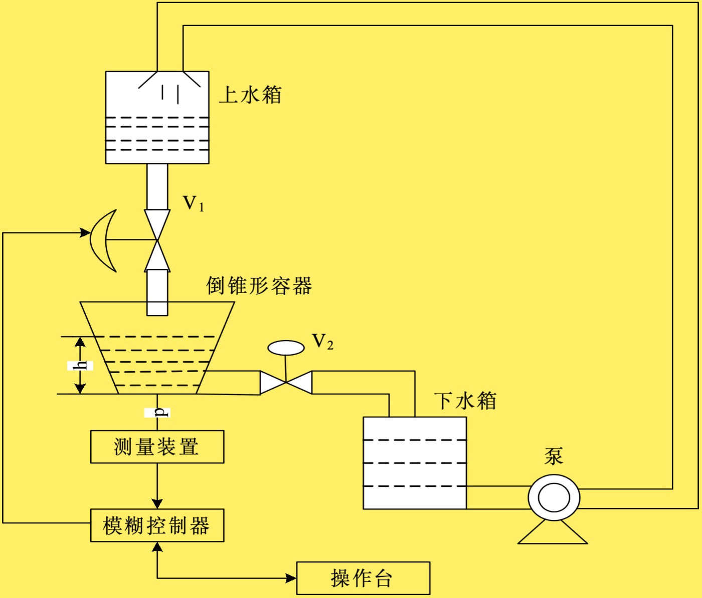

# water-tank: 单水箱液位模糊控制系统设计

《基于Matlab的单水箱液位的模糊控制系统设计》是本人的一次课堂作业，由于网上的资源不是很多，所以这边分享一个我对我们的"祖传代码"稍加修改的版本。

## 1. 情景说明

如上图所示，有一个倒锥形容器盛放水，有一个出水口`V_2`，一个入水口`V_1`，现在可以通过测量装置得到当前容器中的水位`h`，现在需要设计一个模糊控制系统，使得水位`h`能够稳定在某个目标值。

因此有如下关系：

* 控制目标：倒锥形容器的液位高度h=h0
* 检测装置：通过测量容器底部压力来间接测量液位
* 执行机构：控制进水电磁阀V1的开启度（[0,90°]）。
* 为简单起见，假设电磁阀V1的开启度与进水量间呈线性关系（即上水箱的液位恒定）。
* 注意：受控对象是倒锥形容器，其液位高度h和进水量Q间的关系不是线性关系。电磁阀V2的开度固定，但出水量与倒锥形容器的液位高度成正比。

## 2. 仓库说明

> 本仓库只供学习使用，并且因为本人也比较🥦，所以有不妥之处欢迎指正~

一般情况下，如果要“抄作业”，应该先跑代码（校验一下可行性，一般情况下应该跑得通），然后再看笔者与小组成员上交的文档，这样可以更好地理解。

### 2.1 文档说明

为了观看体验和上传的方便，我将代码和文档分开了，文档在`./docs`文件夹下，代码在`./src`文件夹下。并且为了观看格式的统一，我将文档转为了PDF格式。

### 2.2 代码说明

由于文档中对模糊控制规则进行了对照试验，分为[25规则](./src/main.m)与[5规则](./src/test.m)，所以代码也分为了两个版本。

另一方面，笔者在使用使用的matlab的时候，会有警告说相关的api即将被弃用（但是偷懒所以笔者没改），所以如果来者在跑代码的时候发现跑不通，可以提交[issue](https://github.com/SAKURA-CAT/water-tank/issues)，我看到会尽快修复。

> 或者提交[PR](https://github.com/SAKURA-CAT/water-tank/pulls)也行~

## 3. 代码运行

导入matlab后直接运行即可。两份代码实际上只有在模糊规则定义的部分会有不同，但是为了单个文件的可执行性，会有一些重复的部分。

## 4. 其他

也没啥了，如果来者能够采纳我们小组的代码——或者我们的工作对你有所帮助，将是我们的荣幸。
